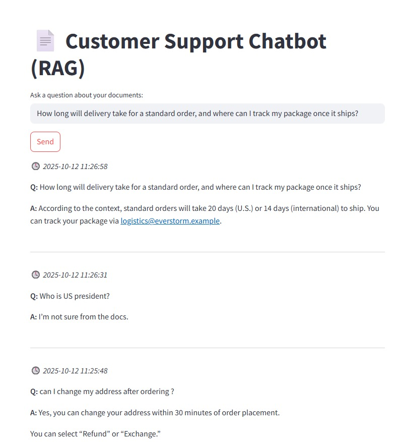

# 🧠 Customer Support Chatbot (RAG)



## 📖 Project Overview

This project is a **Customer Support Chatbot** powered by **Retrieval-Augmented Generation (RAG)**.  
It allows users to ask questions about company documents, and the chatbot responds intelligently by retrieving relevant context from those documents.

If the answer is not found in the provided documents, the chatbot simply replies that it’s unsure — ensuring reliable and context-grounded responses.

---

## 💡 Features
- **RAG (Retrieval-Augmented Generation)** implementation  
- **LLM-powered** question answering  
- **Context-based responses** (no hallucination if info is missing)  
- Simple and clean **frontend interface** for user interaction  

---

## 🧰 Technologies Used
- **Python**
- **LangChain / LlamaIndex / FAISS / ChromaDB** (depending on setup)
- **OpenAI / Hugging Face LLM**
- **Streamlit** for UI

---

## 🚀 How to Run
1. Prepare environment to run RAG API (fast api) and Streamlit App
```
conda env create -f environment.yml && conda activate rag-chatbot
```

2. Run RAG API to make it ready to answer questions
```
uvicorn rag_api:app --host 0.0.0.0 --port 8232 --reload
```
API is running on http://localhost:8232/docs

3. Run streamlit app to ask questions and streamlit app uses RAG API to answer the questions.
```
streamlit run streamlit_app.py 
```
App is running on http://localhost:8501